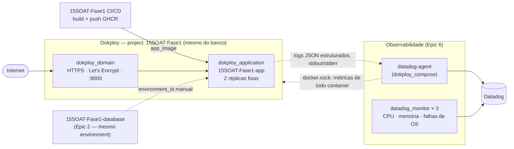

# 15SOAT-Fase1-kubernetes

Terraform que provisiona o recurso de aplicação e o domínio/roteamento
(Traefik) do Workshop OS na Fase 3, no mesmo servidor
[Dokploy](https://dokploy.com) usado pelo banco (repo irmão
[`15SOAT-Fase1-database`](https://github.com/CandidoRPNeto/15SOAT-Fase1-database)).
O "cluster com escalabilidade" desta fase é o orquestrador do próprio
Dokploy — não um Kubernetes real. Ver
[ADR-001](https://github.com/CandidoRPNeto/15SOAT-Fase1/blob/master/docs/architecture/adrs/adr-001-dokploy-as-cloud.md)
e [ADR-006](https://github.com/CandidoRPNeto/15SOAT-Fase1/blob/master/docs/architecture/adrs/adr-006-scaling-approach.md)
(sobre a ressalva de escalabilidade) no repo principal.

Parte do split em 4 repositórios da Fase 3 do projeto
[15SOAT-Fase1](https://github.com/CandidoRPNeto/15SOAT-Fase1) — requisito
completo em [`evolucao_fase3`](https://github.com/CandidoRPNeto/15SOAT-Fase1/blob/master/evolucao_fase3).

## Propósito

Cria, via Terraform, no mesmo `project`/`environment` do
`15SOAT-Fase1-database`:
- `dokploy_application` (`15SOAT-Fase1-app`) — imagem publicada pelo CI/CD
  de `15SOAT-Fase1` (GHCR), 2 réplicas fixas (ver ADR-006), limites de
  CPU/memória iguais aos de `k8s/deployment.yaml`.
- `dokploy_domain` — rota HTTPS (Let's Encrypt) pro domínio público da
  aplicação, porta 8000 (mesma porta do container em `k8s/`).
- `dokploy_compose.datadog_agent` — Datadog Agent (mesmo projeto/environment), coletando métricas de todos os containers via `docker.sock`.
- `datadog_monitor` × 3 — CPU/memória do container (com `notify_no_data` como sinal de uptime, ver [ADR-009](https://github.com/CandidoRPNeto/15SOAT-Fase1/blob/master/docs/architecture/adrs/adr-009-datadog-agent-placement.md)) e falhas de processamento de OS (log alert).

## Tecnologias

- Terraform `>= 1.5`
- Provider [`vanillauys/dokploy`](https://registry.terraform.io/providers/vanillauys/dokploy) `0.10.2`
  (mesma escolha do `15SOAT-Fase1-database` — ver
  [ADR-005](https://github.com/CandidoRPNeto/15SOAT-Fase1/blob/master/docs/architecture/adrs/adr-005-dokploy-terraform-provider.md))
- Provider oficial [`DataDog/datadog`](https://registry.terraform.io/providers/DataDog/datadog) `4.20.0`

## Execução

```bash
export DOKPLOY_ENDPOINT="https://<seu-dokploy>.example.com"
export DOKPLOY_API_KEY="<sua api key>"
export DD_API_KEY="<datadog api key>"
export DD_APP_KEY="<datadog app key>"

terraform init
terraform plan \
  -var="environment_id=<terraform output -raw environment_id, no 15SOAT-Fase1-database>" \
  -var="app_image=ghcr.io/candidorpneto/15soat-fase1:latest" \
  -var="app_domain_host=<seu domínio>" \
  -var="datadog_api_key=$DD_API_KEY"
terraform apply ...  # mesmas -var acima
```

`environment_id` **não** é resolvido automaticamente — sem um backend
remoto compartilhado entre os dois repos (lacuna documentada em
[RFC-002](https://github.com/CandidoRPNeto/15SOAT-Fase1/blob/master/docs/architecture/rfcs/rfc-002-managed-database-strategy.md)),
copie o output do `15SOAT-Fase1-database` antes de aplicar este.

**Nota de rate limit**: a API do Dokploy responde `401` (não `429`) quando
o limite de requisições da API key é excedido — não confundir com
credencial errada num apply real (ver
[ADR-005](https://github.com/CandidoRPNeto/15SOAT-Fase1/blob/master/docs/architecture/adrs/adr-005-dokploy-terraform-provider.md)).

**Status**: `terraform validate` passa contra os providers reais
(`vanillauys/dokploy` 0.10.2 e `DataDog/datadog` 4.20.0); `apply` real
ainda não foi rodado — requer servidor Dokploy acessível, conta Datadog,
API keys e o `environment_id` do Epic 2, nenhum disponível nesta sessão.

## Deploy

`main` e `homolog` protegidas (PR obrigatório). CI (`.github/workflows/ci.yml`)
roda `terraform fmt -check` + `terraform validate`; `apply` automático
(`.github/workflows/deploy.yml`, disparado pelo `deploy-dokploy` do CI/CD
de `15SOAT-Fase1`) fica para quando os 6 secrets estiverem configurados:
`DOKPLOY_ENDPOINT`, `DOKPLOY_API_KEY`, `TF_VAR_ENVIRONMENT_ID`,
`TF_VAR_APP_DOMAIN_HOST`, `DD_API_KEY`, `DD_APP_KEY`.

## Diagrama de arquitetura



## Swagger / Postman

Não aplicável — este repositório é infraestrutura, não expõe API própria.
Ver o Swagger da aplicação em `15SOAT-Fase1` (`/api/documentation`).
